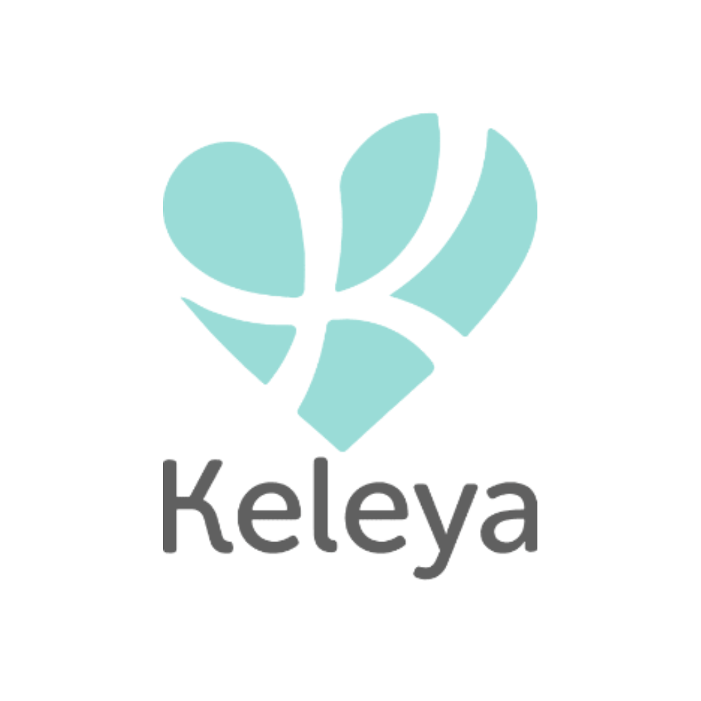

# Keleya Coding Challenge

<div align="center">
    
</div>

This repository contains the solution for the Keleya task as part of the coding challenge provided by [Keleya](https://www.keleya.de/).

## Useful information
### Colors
Below we have a list of useful color.

|Color name| HEX|
|---|---|
|WHITE | #ffffff|
|PALE_TEAL | #69c0ba|
|LIGHT_TEAL | #9adcd7|
|GREYISH_BROWN | #4a4a4a|
|WARM_GREY | #9b9b9b|
|BUBBLE_GUM | #e97db5|

### Screenshots (Developed)
#### iOS
- [App in German Language](https://drive.google.com/drive/folders/1RmXSGlynAk46rwiq3nqD_DwJX375N6wm?usp=sharing)
- [App in English Language](https://drive.google.com/drive/folders/17BFZSVw0P0CmCueAQw5OmKb8oekNI7_4?usp=sharing)

#### Android
- [App in German Language](https://drive.google.com/drive/folders/1PQ4aFNrrBMVeh-dUmz-hfMS9hrtHVj3U?usp=sharing)
- [App in English Language](https://drive.google.com/drive/folders/1v8RxtepsuQINIsNGVwmeyai1erOt87jR?usp=sharing)

### App Demo (Video)
#### iOS
- [App in German Language](https://drive.google.com/file/d/1XGwISYw5m4kob5F5F8t-OiPvM0ogIsDY/view?usp=sharing)
- [App in English Language](https://drive.google.com/file/d/19qoQWHccidGPkjcsysFOXy8zrad_bImq/view?usp=sharing)

#### Android
- [App in German Language](https://drive.google.com/file/d/1ys0eBhyT8TD7FmmGX6AFMGoILrKF7Y0Z/view?usp=sharing)
- [App in English Language](https://drive.google.com/file/d/1RLaZpu-bhDUrMjXUA5LpPbf8IZ51zNHi/view?usp=sharing)

### Android Apk (For Testing)
- [Keleya Apk](https://drive.google.com/file/d/1OkIb3OwHG9m3He-3HtEqzmkHX04k2vA6/view?usp=sharing)

## Prerequisites

- [Node.js > 16](https://nodejs.org) and npm (Recommended: Use [nvm](https://github.com/nvm-sh/nvm))
- [Watchman](https://facebook.github.io/watchman)
- [Xcode](https://developer.apple.com/xcode)
- [Cocoapods](https://cocoapods.org)
- [JDK](https://www.oracle.com/java/technologies/javase-jdk11-downloads.html)
- [Android Studio and Android SDK](https://developer.android.com/studio)

## Base dependencies

- [react-navigation](https://reactnavigation.org/) navigation library.
- [react-native-vector-icons](https://www.npmjs.com/package/react-native-vector-icons) vector icons.
- [react-native-simple-toast](https://www.npmjs.com/package/react-native-simple-toast) Toast component for showing error message.
- [react-native-responsive-dimensions](https://www.npmjs.com/package/react-native-responsive-dimensions) Responsive height, width and fontSize.
- [react-native-modal-datetime-picker](https://www.npmjs.com/package/react-native-modal-datetime-picker) vector icons.
- [react-native-vector-icons](https://reactnavigation.org/) date and time picker.
- [react-native-fast-image](https://www.npmjs.com/package/react-native-fast-image) Image component handles image caching.

## Folder structure

This task follows a very simple project structure:

- `src`: This folder is the main container of all the code inside your application.
  - `assets`: Asset folder to store all images, vectors, etc.
  - `components`: Folder to store any common component that you use through your app (such as a generic button)
  - `constants`: Folder to store any kind of constant that you have.
  - `routes`: Folder to store the navigators.
  - `screens`: Folder that contains all your application screens/features.
    - `Screen`: Each screen should be stored inside its folder and inside it a file for its code and a separate one for the styles and tests.
      - `Screen.tsx`
      - `styles.tsx`
  - `App.js`: Main component that starts your whole app.
  - `index.js`: Entry point of your application as per React-Native standards.
 
## Installation

```bash
$ npm install
OR
$ yarn
```

## Pod Install (For iOS)

```bash
$ cd ios
$ pod install --repo-update
```

## Run iOS build

```bash
$ npx react-native run-ios
```

## Run Android build

```bash
$ npx react-native run-android
```

## Validation Criteria:

### Signup
* Email field can't be empty
* Password field can't be empty
* Email should be properly formatted e.g
  * test@test.com (Accepted)
  * abc.com (Rejected)
  * @gmail.com (Rejected)
* Password must be
  * Minimum eight characters
  * at least one letter
  * at least one number
* Terms & Conditions must be accepted
* Privacy Policy must be accepted


### Signin
* Email field can't be empty
* Password field can't be empty
* Email should be properly formatted e.g
  * test@test.com (Accepted)
  * abc.com (Rejected)
  * @gmail.com (Rejected)
* Password must be
  * Minimum eight characters
  * at least one letter
  * at least one number


### Name
* Name field can't be empty


### Date
* Date field can't be empty


### Workout frequency
* Frequency field can't be empty


